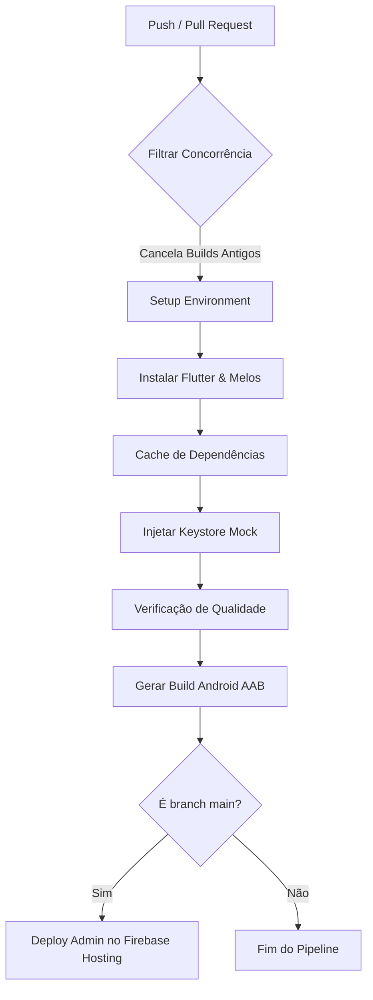

# 🚀 Guia de Deploy & Esteira de CI/CD — Ecossistema Uppi

Este guia descreve de forma consolidada todos os procedimentos necessários para a compilação, assinatura e publicação dos aplicativos móveis, do console web administrativo e do backend em produção, além de detalhar o funcionamento e manutenção da nossa esteira de integração e entrega contínua (CI/CD).

---

## 📱 1. Deploy de Aplicativos Móveis (Manual)

O Super App Uppi é unificado (`apps/rider-frontend`), contendo internamente a interface do Passageiro e o módulo do Motorista (`apps/driver-frontend`). O build deve ser gerado estritamente a partir da raiz do `rider-frontend`.

### 🤖 Android (Google Play Store)

#### Pré-requisitos:
* Keystore de produção (`apps/rider-frontend/android/upload.jks`)
* Arquivo `key.properties` configurado em `apps/rider-frontend/android/key.properties` contendo:
  ```properties
  storePassword=SUA_SENHA_STORE
  keyPassword=SUA_SENHA_KEY
  keyAlias=upload
  storeFile=upload.jks
  ```

#### Comando de Build:
Execute a partir da raiz do monorepo:
```bash
# 1. Gerar arquivos de localização e dependências
melos bootstrap
melos run build:runner

# 2. Compilar o App Bundle (.aab) oficial
# Adicionalmente habilitamos ofuscação e divisão de símbolos de depuração
flutter build appbundle --release --obfuscate --split-debug-info=build/debug-info --target=lib/main.dart
```

O arquivo final será gerado em:  
`apps/rider-frontend/build/app/outputs/bundle/release/app-release.aab`

#### Publicação Manual:
1. Acesse o [Google Play Console](https://play.google.com/console).
2. Selecione o app **Uppi** e navegue até **Produção → Criar nova versão**.
3. Faça upload do arquivo `.aab` gerado.
4. Insira o changelog da versão e envie para aprovação técnica da Google.

---

### 🍎 iOS (Apple App Store)

#### Pré-requisitos:
* Computador macOS com Xcode instalado.
* Conta Apple Developer ativa ($99 USD/ano).
* Certificados de Distribuição e Provisioning Profiles configurados no Xcode.

#### Comando de Build:
Execute a partir da raiz do monorepo:
```bash
# Compilar arquivo de arquivamento IPA
flutter build ipa --release --obfuscate --split-debug-info=build/debug-info
```

#### Publicação Manual:
1. Abra o arquivo gerado `apps/rider-frontend/build/ios/archive/Runner.xcarchive` no Xcode Organizer.
2. Selecione o build e clique em **Distribute App** escolhendo o canal de distribuição **App Store Connect**.
3. Acesse o [App Store Connect](https://appstoreconnect.apple.com/), preencha os metadados, screenshots e submeta para revisão.

---

## 🖥️ 2. Deploy do Console Administrativo Web (Manual)

O painel de controle web (`apps/admin_panel`) é hospedado no **Firebase Hosting** de forma estática e segura.

### Comando de Build e Deploy:
```bash
# 1. Navegue até o módulo do admin
# 2. Compilar em modo release Web
flutter build web --release

# 3. Publicar utilizando o Firebase CLI
firebase deploy --only hosting
```

---

## 📡 3. Deploy do Backend & Migrações (Supabase)

O backend serverless da plataforma fica sob a pasta `/supabase`.

### Comandos do Supabase CLI:
```bash
# Aplicar todas as novas migrações locais ao banco de dados de produção
supabase db push

# Fazer deploy de todas as Edge Functions ativas
supabase functions deploy

# Fazer deploy de uma Edge Function individual (ex: delete-user-account)
supabase functions deploy delete-user-account
```

---

## 🛠️ 4. A Esteira Automatizada de CI/CD (GitHub Actions)

Para manter builds robustos e ágeis, implementamos uma esteira avançada em `.github/workflows/flutter_ci.yml`. Ela executa análises e compilações em nuvem a cada push ou Pull Request na branch principal.



### Recursos Avançados do Workflow:

1. **Política de Concorrência Rígida (`concurrency`)**:
   Utilizamos concorrência no topo do workflow com `cancel-in-progress: true` agrupados por branch (`github.workflow}-${{ github.ref }}`). Se um desenvolvedor fizer múltiplos commits em sequência, as execuções antigas na nuvem são abortadas de imediato, economizando valiosos minutos de servidor.

2. **Cache Inteligente de Compilação**:
   Configuramos caches automáticos do pub.dev e caches internos de compilação do Gradle por meio de hashes do arquivo `pubspec.yaml` e dos scripts da pasta. Isso reduz o tempo médio do pipeline de 15 minutos para **menos de 5 minutos**.

3. **Bypass de Chaves de Assinatura Nativas (Signing Pipeline Bypass)**:
   Para que compilações de testes automáticos ocorram perfeitamente sem expor a Keystore PJ de produção, criamos uma etapa que gera uma chave mock autoassinada e um arquivo `key.properties` fake dinamicamente em runtime de CI. Isso garante que o comando `flutter build appbundle` passe perfeitamente sem dar erro de falta de keystore local.

4. **Entrega Contínua (CD) no Firebase Hosting**:
   Sempre que um commit é integrado na branch principal (`main`), o pipeline executa o build do `apps/admin_panel` e realiza a implantação automática (CD) direto na nuvem do Firebase Hosting via o token de Service Account registrado nos segredos da organização.

---

*Manual atualizado em Maio de 2026 — Engenharia de DevOps Uppi*
