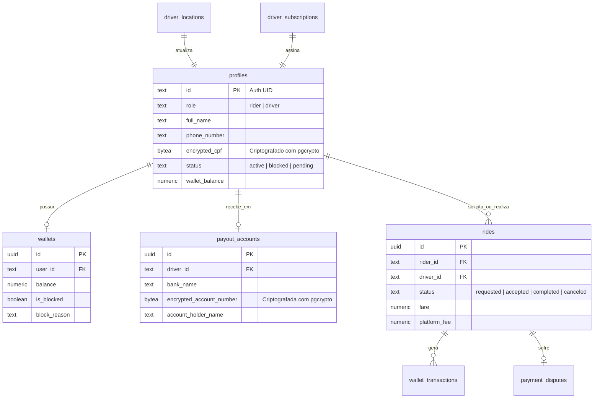

# 📖 Manual de Operação e Runbooks de Incidentes — Ecossistema Uppi

Este guia consolida as rotinas operacionais, diagramas de arquitetura física do banco de dados e procedimentos de recuperação de desastres para a equipe de Engenharia e Operações do Uppi Brasil.

---

## 🗄️ 1. Visão Geral do Schema de Banco de Dados

O banco de dados PostgreSQL do Uppi utiliza **Row Level Security (RLS)** em 100% de suas tabelas operacionais e é integrado com a extensão espacial **PostGIS** para consultas de geolocalização em tempo real.

### Principais Tabelas e Relacionamentos


---

## 🚨 2. Runbooks de Recuperação de Incidentes

### Runbook A: Recuperação de Latência Alta ou Banco Travado (Locks)
Quando a API apresentar lentidão acentuada ou as corridas não forem distribuídas (despacho travado), o banco pode estar sob concorrência excessiva de travas (locks).

#### Diagnóstico (Executar no SQL Editor do Supabase):
```sql
-- 1. Identificar queries ativas que estão rodando há mais de 10 segundos
SELECT pid, age(clock_timestamp(), query_start), usename, state, query 
FROM pg_stat_activity 
WHERE state != 'idle' AND age(clock_timestamp(), query_start) > interval '10 seconds'
ORDER BY age DESC;

-- 2. Identificar locks em andamento travando outras transações
SELECT
    blocked_locks.pid     AS blocked_pid,
    blocked_activity.usename  AS blocked_user,
    blocking_locks.pid    AS blocking_pid,
    blocking_activity.usename AS blocking_user,
    blocked_activity.query    AS blocked_statement,
    blocking_activity.query   AS blocking_statement
FROM  pg_catalog.pg_locks         blocked_locks
JOIN pg_catalog.pg_stat_activity blocked_activity ON blocked_activity.pid = blocked_locks.pid
JOIN pg_catalog.pg_locks         blocking_locks 
    ON blocking_locks.locktype = blocked_locks.locktype
    AND blocking_locks.database IS NOT DISTINCT FROM blocked_locks.database
    AND blocking_locks.relation IS NOT DISTINCT FROM blocked_locks.relation
    AND blocking_locks.page IS NOT DISTINCT FROM blocked_locks.page
    AND blocking_locks.tuple IS NOT DISTINCT FROM blocked_locks.tuple
    AND blocking_locks.virtualxid IS NOT DISTINCT FROM blocked_locks.virtualxid
    AND blocking_locks.transactionid IS NOT DISTINCT FROM blocked_locks.transactionid
    AND blocking_locks.classid IS NOT DISTINCT FROM blocked_locks.classid
    AND blocking_locks.objid IS NOT DISTINCT FROM blocked_locks.objid
    AND blocking_locks.objsubid IS NOT DISTINCT FROM blocked_locks.objsubid
    AND blocking_locks.pid != blocked_locks.pid
JOIN pg_catalog.pg_stat_activity blocking_activity ON blocking_activity.pid = blocking_locks.pid
WHERE NOT blocked_locks.granted;
```

#### Solução:
Se houver uma query ofensora (como um dump pesado ou loop de despacho órfão) bloqueando a tabela `rides` ou `driver_locations`, termine o processo utilizando:
```sql
-- Finalizar de forma segura (solicita cancelamento)
SELECT pg_cancel_backend(blocking_pid);

-- Se persistir, forçar o término (derruba o processo imediatamente)
SELECT pg_terminate_backend(blocking_pid);
```

---

### Runbook B: Falha na Validação de Assinatura Webhook (Mercado Pago)
Se a integração com o Mercado Pago parar de processar pagamentos PIX automaticamente e os logs da Edge Function `mercado-pago-webhook` mostrarem a mensagem `Signature verification failed`, siga os passos abaixo.

#### Causas Comuns:
1. O segredo `mp_webhook_secret` foi rotacionado no painel do Mercado Pago mas não foi atualizado no banco/env do Uppi.
2. Cabeçalho `x-signature` corrompido ou ausente devido a proxies/Cloudflare intermediários.

#### Resolução Emergencial:
1. Acesse o **Mercado Pago Dashboard** -> Suas integrações -> Webhooks.
2. Copie o segredo HMAC correspondente.
3. Se estiver usando o fallback de banco de dados, execute o update do segredo via Admin Panel (Modo Superadmin) ou via SQL Editor:
   ```sql
   INSERT INTO public.app_settings (key, value)
   VALUES ('mp_webhook_secret', 'NOVO_SEGREDO_COPIADO')
   ON CONFLICT (key) DO UPDATE SET value = EXCLUDED.value;
   ```
4. Se o problema for persistente e as transações precisarem ser liberadas sob urgência, é possível habilitar temporariamente o bypass de assinatura HMAC comentando a validação ou adicionando um bypass para IPs específicos, mas o recomendado é realizar a reconciliação manual (Runbook C).

---

### Runbook C: Falha de Repasse de PIX Automático / Reconciliação Manual
Se o motorista solicitar um saque (payout) e a transação falhar por limite diário da API do gateway de pagamento ou indisponibilidade do sistema PIX do Mercado Pago.

#### Procedimento de Resolução Manual:
1. **Identificar o Payout Solicitado**:
   Acesse a tabela `payout_requests` filtrando por transações em estado `'pending'` ou `'failed'`.
   ```sql
   SELECT id, driver_id, amount, status, created_at
   FROM public.payout_requests
   WHERE status = 'pending';
   ```
2. **Consultar Dados Bancários do Motorista**:
   Acesse os dados bancários descriptografados de forma transparente via painel de administração (Aba "Dados Financeiros" no dialog do motorista) ou via SQL (exige role admin):
   ```sql
   SELECT bank_name, account_holder_name, account_number
   FROM public.payout_accounts
   WHERE driver_id = 'ID_DO_MOTORISTA_DESEJADO';
   ```
3. **Efetuar o PIX Manualmente**:
   Utilizando a conta bancária PJ de operação da plataforma Uppi, efetue a transferência manual do valor correspondente ao `amount` obtido.
4. **Liquidar a Solicitação no Banco**:
   Após o PIX manual ser concluído com sucesso e o comprovante ser arquivado, atualize o status da solicitação para evitar dupla transferência:
   ```sql
   -- Atualizar o status para concluído
   UPDATE public.payout_requests
   SET status = 'completed', updated_at = now()
   WHERE id = 'ID_DO_PAYOUT_REQUEST';

   -- Adicionar registro ao log de auditoria do admin
   INSERT INTO public.admin_audit_log (admin_id, action_type, target_resource_id, details)
   VALUES (
     'ID_DO_ADMIN_LOGADO',
     'manual_payout_pax_processed',
     'ID_DO_PAYOUT_REQUEST',
     '{"payment_method": "manual_bank_transfer", "bank": "MercadoPago PJ"}'
   );
   ```

---

### Runbook D: Configuração, Rotação e Manutenção de Segredos de CI/CD (GitHub Actions)
Se a credencial do Firebase Service Account para publicação automática do `admin_panel` expirar, ou se for necessário rotacionar chaves Gradle e keystores para build Android em nuvem.

#### Procedimento de Atualização:
1. **Atualizar a Conta de Serviço do Firebase (Firebase Service Account)**:
   - Gere uma nova chave JSON na aba **Contas de Serviço** do Firebase Console.
   - Copie o conteúdo JSON completo.
   - Acesse o repositório no GitHub -> **Settings -> Secrets and variables -> Actions**.
   - Atualize o segredo `FIREBASE_SERVICE_ACCOUNT_UPPI` (ou `FIREBASE_SERVICE_ACCOUNT_UPPI_BRAZIL` dependendo do mapeamento de segredos do seu repositório) com o conteúdo copiado.
2. **Atualizar Chaves de Assinatura Android (Keystore/Signing Bypass)**:
   - Se as chaves reais PJ mudarem, atualize os respectivos segredos do GitHub Actions:
     * `ANDROID_KEYSTORE_BASE64` (o arquivo `upload.jks` codificado em base64: `certutil -encode upload.jks upload.b64` no Windows).
     * `ANDROID_KEYSTORE_PASSWORD` (senha do arquivo de chaves).
     * `ANDROID_KEY_ALIAS` (normalmente `upload`).
     * `ANDROID_KEY_PASSWORD` (senha da chave individual).
   - O pipeline do GitHub Actions detectará automaticamente e injetará as chaves no processo de compilação em nuvem.

---

## 🔒 3. Políticas Gerais de Segurança de Dados (LGPD)

1. **Criptografia em Repouso**: Todos os CPFs (`profiles_raw.encrypted_cpf`) e Contas Bancárias (`payout_accounts_raw.encrypted_account_number`) são fisicamente guardados como `BYTEA` (binário criptografado por cifra AES).
2. **Auditoria de Acesso**: Qualquer leitura ou modificação em ambiente de produção deve ser efetuada via Views protegidas. A chave criptográfica simétrica simula um cofre digital e é lida de forma hierárquica (GUC de sessão -> Supabase Vault -> Local fallback).
3. **Descarte de Dados (Right to be Forgotten)**: A exclusão de um perfil de usuário aciona o expurgo físico total em cascata de documentos e avatares nos buckets de Storage, define CPFs e dados bancários como `NULL` no perfil, e remove a conta de payout do motorista de imediato.
